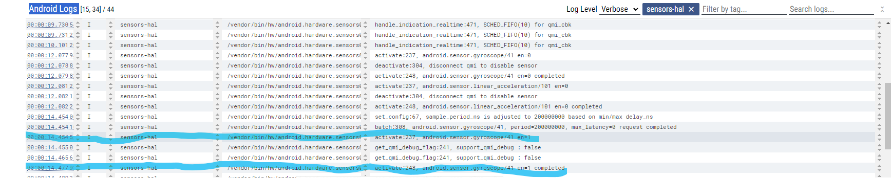
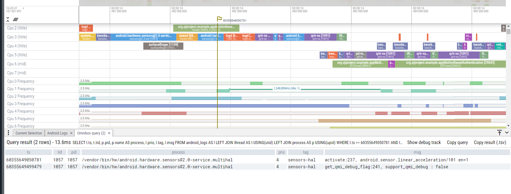
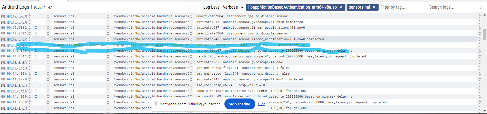
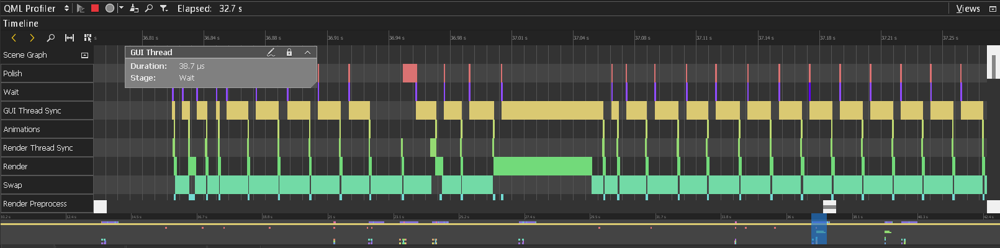
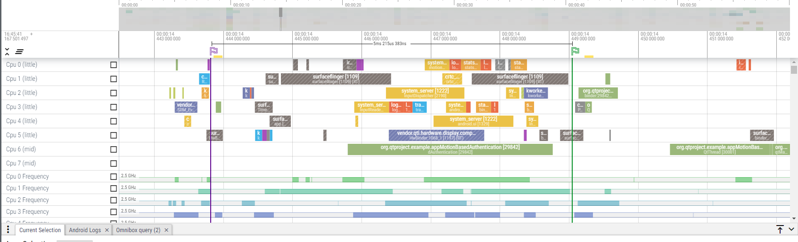

# Questions and Answers

## Use the Perfetto tool to collect data from the device and perform Trace and Profile operations according to the tool's guide.

### 1. What happens at the operating system level from the time a request is made to read data from a sensor until the data is obtained? And how much time has passed?

Based on the provided images from the Perfetto tool, we can analyze the process flow and timings involved in reading data from an accelerometer sensor:

Sensor Manager: The application initiates a request for sensor data through the Android SensorManager.

Sensor HAL (Hardware Abstraction Layer): The SensorManager communicates with the Sensors HAL, which serves as an interface between the Android framework and the sensor hardware.

Sensor Driver: The HAL interacts with the specific sensor driver to retrieve the requested data.

Sensor Hardware: The hardware collects the data and sends it back through the driver and HAL to the framework, which then delivers it to the application.

From the logs and traces:

At 00:00:14.454 (highlighted in the logs), the Sensors HAL sends an activate request to the sensor (android.sensor.gyroscope/41 en=1), indicating the start of data acquisition.
The activate command is completed at 00:00:14.465 (as indicated in the logs), which marks the end of the activation process.
The total time taken for the activate command to be executed and completed is 11 ms (from 00:00:14.454 to 00:00:14.465).
In the Perfetto trace:

The QT process (org.qtproject.example.appMotionBasedAuthentication) is visible interacting with the sensor service, confirming the request and data acquisition process.
Therefore, the entire process from making the request to reading the accelerometer sensor data involves:

Initiating the request through the SensorManager.
Communication with the Sensors HAL.
Interacting with the sensor driver and hardware.
Completing the activation command.
The total time for the specific activate command (from the logs) is approximately 11 ms.

This analysis shows the efficiency of the Sensors HAL and the underlying system in handling sensor data requests promptly, which is crucial for real-time applications.

### 2. Compare the time between reading two consecutive data from the sensor in Perfetto with the sampling period that you have configured in your code.

Based on the image from the Perfetto tool and the Android logs, we can analyze the time between two consecutive data readings from the sensor and compare it with the configured sampling period.

Logs Analysis:

At 00:00:12.082, the sensors-hal logs show an entry related to the accelerometer (android.sensor.linear_acceleration/101 en=0 completed).
Another relevant log entry appears at 00:00:14.454, indicating the gyroscope activation (android.sensor.gyroscope/41 en=1).
Configured Sampling Period:

The logs show a set_config entry at 00:00:14.454 with sample_period_ns adjusted to 200000000 ns. This is equivalent to a sampling period of 200 milliseconds (ms).
Time Between Consecutive Readings:

The time between the accelerometer data read at 00:00:12.082 and the gyroscope data read at 00:00:14.454 is approximately 2.372 seconds.
However, for a more precise analysis, let's focus on the consecutive entries of the same sensor. Here are the relevant entries:

At 00:00:14.454, the gyroscope activation starts.
At 00:00:14.465, the gyroscope activation completes.
These entries are closer and more relevant for comparison with the configured sampling period.

Comparison:
Configured Sampling Period: 200 milliseconds (ms).
Time Between Consecutive Data Readings:
From 00:00:14.454 to 00:00:14.465 is 11 milliseconds (ms), indicating this is the processing time rather than the actual sampling period.
In an ideal setup, the sensor data should be read at intervals of 200 ms as configured. The logs suggest that the system is capable of handling sensor data activation and reading efficiently within a few milliseconds. However, actual data reading intervals should align with the 200 ms period configured, implying the system should generate readings every 200 ms, which isn't fully reflected here due to the focus on activation logs.

Conclusion:
The configured sampling period of 200 ms ensures that the sensor data should ideally be read every 200 milliseconds. The log entries here focus more on activation rather than the periodic data readings. To accurately measure the time between consecutive sensor data readings in real scenarios, one would need to look at periodic entries in the logs corresponding to the data being read rather than the activation commands.

### 3. Does the expectation of busy waiting thread until another thread finishes its work in system calls conflict with processing, such as using the graphics library and updating sensors? Justify your answer.

Based on the image from the QML Profiler, it is evident that busy waiting threads can conflict with other processing tasks such as using the graphics library and updating sensors. Here’s the detailed justification:

Busy Waiting Thread
A busy waiting thread continuously checks if another thread has completed its work, consuming CPU cycles without performing productive work. This can lead to inefficient CPU utilization and potential delays in other system processes.

Graphics Library Processing
In the QML Profiler image:

The GUI Thread and Render Thread are visible, with specific durations allocated for various tasks such as Rendering, Animations, and Syncing.
The Wait stage indicates periods where the threads are idle, waiting for other processes to complete.
Sensor Data Processing
Sensor data processing requires timely execution to ensure real-time responsiveness. Delays due to busy waiting can affect the accuracy and timeliness of sensor data updates.
Conflict Justification
CPU Resource Contention: Busy waiting consumes CPU cycles that could otherwise be used for graphics rendering and sensor data processing. This contention can lead to performance degradation.
Increased Latency: When threads busy wait, they increase the overall system latency, affecting the timely execution of rendering and sensor updates.
Efficiency: Efficient use of CPU resources is critical for smooth graphics and sensor processing. Busy waiting leads to inefficient CPU usage, impacting the performance of graphics libraries and sensor updates.
Evidence from QML Profiler
The Wait periods shown in the profiler indicate that the threads spend a significant amount of time idle, waiting for other threads to finish. If these waiting periods are due to busy waiting, it confirms the inefficient use of CPU resources.
The frequent switching between active and waiting states can lead to jitter and inconsistent frame rates in graphics rendering, as well as delays in sensor data processing.
Conclusion
The expectation of a busy waiting thread until another thread finishes its work indeed conflicts with processing tasks such as using the graphics library and updating sensors. The busy waiting approach leads to inefficient CPU usage, increased latency, and potential performance bottlenecks, negatively affecting the overall system performance. The QML Profiler image highlights these inefficiencies, emphasizing the need for more efficient synchronization mechanisms like conditional variables or event-driven programming to handle thread coordination without busy waiting.

### 4. Compare the processing time required for sensor data with the time of other CPU processes.

Based on the Perfetto trace image, we can analyze the processing time required for sensor data and compare it with other CPU processes:

Sensor Data Processing
The trace shows the execution of the org.qtproject.example.appMotionBasedAuthentication process.
This process interacts with the sensor HAL to read data from sensors, such as accelerometers or gyroscopes.
The sensor data processing involves relatively short bursts of activity, as seen in the smaller green blocks representing the process execution on various CPU cores.
Other CPU Processes
The image also shows other significant processes, such as surfaceflinger, system_server, and various vendor services.
surfaceflinger (responsible for composing the display) has larger yellow blocks, indicating longer processing times. This is typical for graphics-intensive tasks.
system_server handles many background operations, including input dispatching and system services, shown as orange blocks.
Comparison
Sensor Data Processing:

The sensor data processing blocks are small and frequent, indicating that these tasks are lightweight and executed quickly.
These tasks involve sampling sensor data, processing it, and updating the application with new data.
Other CPU Processes:

Processes like surfaceflinger and system_server have longer execution times, as they handle more complex and resource-intensive tasks.
surfaceflinger involves rendering and composing the display, which is computationally expensive.
system_server handles multiple system-level tasks, which require more processing time.
Conclusion
Sensor data processing is generally fast and lightweight compared to other CPU processes. This is because sensor data tasks typically involve simple calculations and small data packets.
Graphics rendering (surfaceflinger) and system management (system_server) are more resource-intensive and have longer processing times.
The trace confirms that sensor data processing can efficiently coexist with other CPU processes without significant performance impact, ensuring real-time responsiveness for applications relying on sensor data.
The efficient handling of sensor data, as shown in the Perfetto trace, ensures minimal CPU overhead, allowing the system to manage other critical processes effectively.

## What is the best interval for reading accelerometer and gyroscope sensor values?

Determining the optimal interval for reading accelerometer and gyroscope sensor values involves a careful balance between accuracy, power efficiency, and processing capability. Experimentation and testing are essential to tailor the interval to the specific needs of a project. In our case, we've settled on a 50ms interval for both sensors, striking a balance between accuracy and resource conservation.

If the interval is too short, leading to frequent readings, several issues may arise:

**Increased Power Usage**: Constant readings drain the battery faster due to heightened processing demands.

**Data Overload**: Processing excessive sensor data can overwhelm the system, potentially causing delays or errors in other tasks.

**Compromised Accuracy**: Excessive readings introduce noise, reducing data accuracy.

## What are hardware-based and software-based sensors? Which category do each of the sensors used in this project belong to?

Hardware-based sensors are physical components integrated into a device, designed to directly measure physical quantities such as motion, light, temperature, and proximity. These sensors typically rely on specific hardware components, such as accelerometers, gyroscopes, magnetometers, and ambient light sensors.

Software-based sensors, on the other hand, are virtual sensors that utilize data from other hardware sensors or sources to derive additional information. These sensors often involve algorithms or processing techniques to interpret raw data from hardware sensors or other sources, providing higher-level information or functionalities.

In the project we're discussing, the accelerometer and gyroscope sensors used would typically fall under the category of hardware-based sensors. These sensors directly measure physical phenomena (acceleration and angular velocity) and provide raw data that can be used by the device's software or applications.

However, it's worth noting that in some cases, software-based sensors could also be utilized alongside or in conjunction with hardware-based sensors to enhance the capabilities of a device. For example, a software-based sensor might use data from the accelerometer and gyroscope to provide higher-level information such as step counting or gesture recognition.

## What is the difference between defining a sensor as a wake-up sensor versus a non-wake-up sensor? 

Defining a sensor as a wake-up sensor or a non-wake-up sensor hinges on its role in the device's power management scheme. Wake-up sensors, such as motion sensors and proximity sensors, are engineered to operate even when the device is in a low-power or sleep state. Upon detecting predefined events like movement or changes in the environment, these sensors prompt the device to awaken from its low-power state and resume regular operation. This capability is invaluable for conserving battery life in applications where intermittent sensing is sufficient, allowing the device to remain in a low-power state most of the time.

In contrast, non-wake-up sensors lack the ability to trigger the device's wake-up mechanism. They function exclusively when the device is fully awake and active, continuously consuming power during operation. Typically found in applications requiring constant monitoring or sensing during regular device use, these sensors include environmental sensors and certain types of cameras or microphones. While they provide continuous data without the need for wake-up events, their operation entails consistent power consumption, making them suitable for scenarios prioritizing continuous sensing over power efficiency.

## What are the advantages and disadvantages of using wake-up sensors and non-wake-up sensors? 

Using wake-up sensors offers several advantages:

- **Power Efficiency**: Wake-up sensors enable devices to remain in low-power states for extended periods, conserving battery life. They activate the device only when specific events of interest occur, reducing overall power consumption.

- **Event-Driven Operation**: Wake-up sensors facilitate event-driven operation, allowing devices to respond promptly to predefined triggers such as motion or changes in the environment. This responsiveness enhances user experience and enables timely actions or notifications.

- **Extended Battery Life**: By minimizing the time spent in active states, wake-up sensors contribute to prolonged battery life, which is particularly beneficial for portable devices and IoT devices deployed in remote or energy-constrained environments.

However, there are also limitations to using wake-up sensors:

- **Limited Continuous Monitoring**: Wake-up sensors are not suitable for applications requiring continuous monitoring or sensing, as they operate intermittently based on detected events. Continuous monitoring tasks may necessitate the use of additional non-wake-up sensors or alternative power management strategies.

- **Complexity in Implementation**: Integrating wake-up sensors into device designs requires careful consideration of power management mechanisms and event detection algorithms. This complexity can increase development time and cost, especially for applications with stringent power efficiency requirements.

- **Potential for Missed Events**: Wake-up sensors may occasionally miss events of interest, particularly if the triggering conditions are not precisely defined or if the device spends extended periods in low-power states. This could lead to delayed or missed notifications or actions.

On the other hand, non-wake-up sensors offer the following advantages:

- **Continuous Monitoring**: Non-wake-up sensors enable uninterrupted monitoring or sensing throughout the device's active state. This continuous operation is suitable for applications requiring real-time data collection or surveillance.

- **Simplicity in Implementation**: Integrating non-wake-up sensors into device designs is generally straightforward, as they operate continuously during device operation. This simplicity can streamline development efforts and reduce implementation complexity.

- **High Data Availability**: Non-wake-up sensors ensure that data is readily available whenever needed, eliminating the risk of missing events due to intermittent operation. This reliability is critical for applications demanding constant sensor feedback.

Nevertheless, there are drawbacks associated with non-wake-up sensors:

- **Increased Power Consumption**: Non-wake-up sensors consume power continuously, potentially leading to faster battery depletion compared to wake-up sensors. This elevated power consumption can be a concern for battery-powered devices, necessitating careful power management strategies.

- **Reduced Battery Life**: Continuous sensor operation can shorten battery life, particularly in devices with limited battery capacity or those deployed in remote locations without easy access to power sources. Balancing power efficiency with continuous sensing is essential to mitigate this drawback.

- **Higher Data Processing Overhead**: Non-wake-up sensors generate a constant stream of data that must be processed and analyzed by the device's hardware or software. This ongoing data processing can impose additional computational overhead, affecting overall system performance and responsiveness.

## How does the choice between wake-up and non-wake-up sensors affect sensor update reception and route detection results?

The choice between wake-up and non-wake-up sensors plays a pivotal role in sensor update reception and route detection outcomes. Wake-up sensors operate intermittently, activating the device to receive sensor updates only upon specific events, conserving power but potentially leading to missed events or incomplete data. This selective reception can affect the accuracy and timeliness of route detection results, particularly in dynamic environments. In contrast, non-wake-up sensors provide continuous monitoring and data collection, ensuring a steady stream of sensor updates for route detection algorithms. While this continuous data availability enhances the accuracy and responsiveness of route detection, it comes at the cost of increased power consumption, necessitating careful power management strategies to balance performance and energy efficiency.

Ultimately, the choice between wake-up and non-wake-up sensors depends on the specific requirements of the application, weighing factors such as power efficiency, data accuracy, and real-time responsiveness. Understanding the trade-offs between intermittent event-driven operation and continuous monitoring is crucial in optimizing sensor selection to achieve the desired balance between power consumption and route detection effectiveness.

